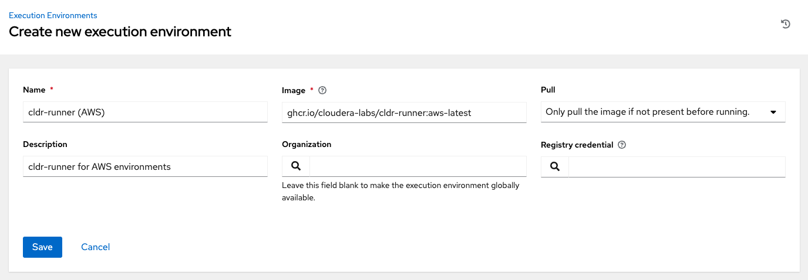

# cldr-runner - Ansible Execution Environments for Cloudera Data Platform (CDP)

[](https://github.com/cloudera-labs/cldr-runner/actions/workflows/publish_matrix_images.yml)

`cldr-runner` is set of Ansible [Execution Environments](https://ansible.readthedocs.io/projects/builder/en/stable/#execution-environments) for running Cloudera playbooks, examples, and general automation for [**Cloudera Data Platform (CDP) Public Cloud, Private Cloud, and Data Services**](https://www.cloudera.com/products/cloudera-data-platform.html). These images are appropriate for use with [`ansible-navigator`](https://ansible.readthedocs.io/projects/navigator/) and [AWX](https://github.com/ansible/awx)/[Red Hat Ansible Automation Platform (AAP)](https://www.redhat.com/en/technologies/management/ansible).

Specifically, the project consists of `execution-environment.yml` configuration files and other supporting assets that power [`ansible-builder`](https://ansible.readthedocs.io/projects/builder/en/latest/). The configurations encapsulate the necessary Ansible collections and roles, Python libraries, and system applications to work with Cloudera's products and cloud providers. Moreover, the resulting images have the needed tooling for managing infrastructure if so requested.

`cldr-runner` builds several profiles:

| Tag | Description |
|-----|-------------|
| [base](base/execution-environment.yml) | Core Ansible, collections, and dependencies including Terraform |
| [aws](aws/execution-environment.yml) | `base` plus AWS-specific collections and dependencies, including the `aws` CLI |
| [azure](azure/execution-environment.yml) | `base` plus Azure-specific collections and dependencies, including the `az` CLI |
| [gcp](gcp/execution-environment.yml) | `base` plus GCP-specific collections and dependencies, including the `gcloud` CLI |
| [full](full/execution-environment.yml) | All of the above, plus additional CLI tools for in-container usage, e.g. `git`, `vim`, `nano`, `tree`, `kubectl` |

Each image is tagged `cloudera-labs/cldr-runner-<profile>:<version>`.

# Quickstart

`cldr-runner` is designed to run with `ansible-navigator` and other _Execution Environment_-based tools. You might want to [install `ansible-navigator`](NAVIGATOR.md) before delving deeper.

1. [Installing and using images](#installing-and-using)
2. [Building local images](#building)
3. [Customizing or extending images](#customizing)
4. [Making a local development environment](#local-development)

# Roadmap

If you want to see what we are working on or have pending, check out:

* the [Milestones](https://github.com/cloudera-labs/cldr-runner/milestones) and [active issues](https://github.com/cloudera-labs/cldr-runner/issues?q=is%3Aissue+is%3Aopen+milestone%3A*) to see our current activity,
* the [issue backlog](https://github.com/cloudera-labs/cldr-runner/issues?q=is%3Aopen+is%3Aissue+no%3Amilestone) to see what work is pending or under consideration, and
* the [Ideas](https://github.com/cloudera-labs/cldr-runner/discussions/categories/ideas) discussion to see what we are considering..

Are we missing something? Let us know by [creating a new issue](https://github.com/cloudera-labs/cldr-runner/issues/new) or [posting a new idea](https://github.com/cloudera-labs/cldr-runner/discussions/new?category=ideas)!

# Contributing

For more information on how to get involved with the `cldr-runner` project, head over to [CONTRIBUTING.md](CONTRIBUTING.md).

# Installing and Using

You can run Ansible within `cldr-runner` Execution Environments a couple of different ways. Here are the most common:

## `ansible-navigator` 

Using a `cldr-runner` image in the [`ansible-navigator` application](https://ansible.readthedocs.io/projects/navigator/) as the designated [Execution Environment](https://docs.ansible.com/ansible/devel/getting_started_ee/index.html) is straightforward. Update your `ansible-navigator.yml` configuration file to enable the image:

```yaml
ansible-navigator:
  execution-environment:
    container-engine: docker
    enabled: True
    image: ghcr.io/cloudera-labs/cldr-runner-aws:latest
    pull:
      policy: missing
```

Once defined, you can run your Ansible activities within the resulting `cldr-runner` container, e.g. `ansible-navigator run your_playbook.yml`. (You can specify the image via the `ansible-navigator` CLI; set `--eei` or `--execution-environment-image`.)

> [!NOTE]
> If you want to "drop into" the container directly, i.e. run a shell within the container, run `ansible-navigator exec -- /bin/bash` and all the mounts, environment variables, etc. are handled for you!! Now from the shell, you can still run `ansible-playbook` and all other Ansible applications. 

## AWX/AAP

You can specify a `cldr-runner` image as an [Execution Environment](https://docs.ansible.com/automation-controller/latest/html/userguide/execution_environments.html).



Once defined, the EE can be used by Job Templates, Container Groups, etc.

## `docker run`

> [!WARNING]
> This mode of operation is not suggested. If you need direct container access, use `ansible-navigator exec -- /bin/bash` as suggested in the [section above](#ansible-navigator).

You can run the container directly in `docker` (or `podman`):

```bash
docker run -it ghcr.io/cloudera-labs/cldr-runner-aws:latest /bin/bash
```

Take care to assemble and mount the needed directories other supporting assets; the image is based on [`ansible-runner`](https://ansible.readthedocs.io/projects/runner/en/stable/) (as are all Execution Environments) and runs as such.

# Building

If you need to construct a local image, first set up a Python virtual environment with the latest `ansible-core` and `ansible-builder`:

```bash
python -m venv ~/location/of/venv; source ~/location/of/venv/bin/activate; pip install ansible-builder
```

> [!NOTE]
> If you have already set up `ansible-navigator`, then you have `ansible-builder`!

Then change into the directory of the `cldr-runner` variation you need to build and run:

```bash
ansible-builder build --prune-images --squash all --build-arg BUILD_VER=<your version> --build-arg BUILD_DATE=$(date -u +"%Y-%m-%dT%H:%M:%SZ") --tag <your tag> 
```

You may want to update the variation's `execution-environment.yml` configuration file to use a different base image, say a local image, or build the `base` image before constructing CSP or `full` image. You can make this change in the following section of the configuration file:

```yaml
images:
  base_image:
    name: <your upstream base image>
```

The resulting image will now be loaded into your local image cache.

# Customizing

A common approach to using `cldr-runner` is to use it as a base and add additional resources -- like other Ansible collections -- for use with your playbooks, and [`ansible-builder`]() handles for this activity.

First, define your custom [Execution Environment definition](https://ansible.readthedocs.io/projects/builder/en/latest/definition/). In the example below, we are using the latest AWS image and adding two private Ansible collections, a public Ansible role, and a public Python library that we need to run our project's playbooks.

```yaml
version: 3

images:
  base_image:
    name: ghcr.io/cloudera-labs/cldr-runner-aws:latest

dependencies:
  galaxy:
    collections:
      - name: https://internal.example.com/my-team/example.stuff
        type: git
        version: devel
      - name: https://internal.example.com/another-team/example.things
        type: git
        version: feature/cool-things
    roles:
      - ansible.scm

additional_build_steps:
  append_final:
    RUN pip install jsonschema
```

Construct your custom image with `ansible-builder` (in the command below, we are using [`ansible-navigator` to call `ansible-builder`](https://ansible.readthedocs.io/projects/navigator/subcommands/#ansible-builder).)

```bash
ansible-navigator builder build -t internal.example.com/my-team/my-runner:latest --squash new --prune-images -v 3
```

And now you can reference your (local) custom image in your project's `ansible-navigator.yml` file:

```yaml
ansible-navigator:
  execution-environment:
    container-engine: docker
    enabled: True
    image: internal.example.com/my-team/my-runner:latest
    pull:
      policy: missing
```

# Local Development

The `cldr-runner` project can also be used to bootstrap a local development environment on the native host environment (as opposed to an Execution Environment image).  This option is more involved, but can avoid issues with Docker, such as mount latencies and SSH agent forwarding, and improve overall Ansible collection development. 

The `local_development.yml` playbook sets up a `cldr-runner`-like workspace for OSX and Ubuntu.  The playbook will clone the Cloudera collections and `cdpy` for local work, install the external Ansible dependencies, update the Python `venv`, and create a convenient setup script for future work.

> [!NOTE]
> The cloned Cloudera collections and `cdpy` project use the `main` branches by default. Manipulating the branches is outside the scope of the `local_development.yml` playbook.

> [!IMPORTANT]
> If you are using an M1 or M2 Macbook, enable the Rosetta within your terminal to ensure compatibility and prevent library incompatibilities between architectures. Go to `Finder > Applications` and then `Terminal > <right-click on your Terminal> > Get Info > Enable "Open using Rosetta"` (or whatever application you want to use).

Development in this manner starts with sourcing the setup script, activating the virtual environment, and then switching to and running `cldr-runner`-based applications, such as `ansible-navigator`-based [`cloudera-deploy` definitions](https://github.com/cloudera-labs/cloudera-deploy), using the development environment's collections and tools.

See [Advanced Usage: Execution Modes](NAVIGATOR.md#advanced-usage-execution-modes) for details on how you can use a host-based, local Ansible environment for execution and development.

## Local setup instructions

Follow these steps to set up a local environment:

1. Create a new virtual environment (using your favorite `venv` app; example uses `virtualenvwrapper`):

   ```bash
   mkvirtualenv <your development directory>
   ```

2. Set up the bootstrap requirements:

   ```bash
   export ANSIBLE_COLLECTIONS_PATH=<your target development directory>
   pip install ansible-core==2.12.*
   ansible-galaxy collection install community.general
   ```

3. Make sure you are able to connect to public GitHub via SSH and then construct the development environment:

    ```bash
    ansible-playbook local_development.yml
    ```

   > [!WARNING]
   > For Ubuntu deployments, you will need to add the `--ask-become-pass` flag to the above command.

4. Source the `setup-ansible-env.sh` file to use this development environment.

    ```bash
    source <your development directory>/setup-ansible-env.sh
    ```

# License and Copyright

Copyright 2024, Cloudera, Inc.

```
Licensed under the Apache License, Version 2.0 (the "License");
you may not use this file except in compliance with the License.
You may obtain a copy of the License at

    http://www.apache.org/licenses/LICENSE-2.0

Unless required by applicable law or agreed to in writing, software
distributed under the License is distributed on an "AS IS" BASIS,
WITHOUT WARRANTIES OR CONDITIONS OF ANY KIND, either express or implied.
See the License for the specific language governing permissions and
limitations under the License.
```
