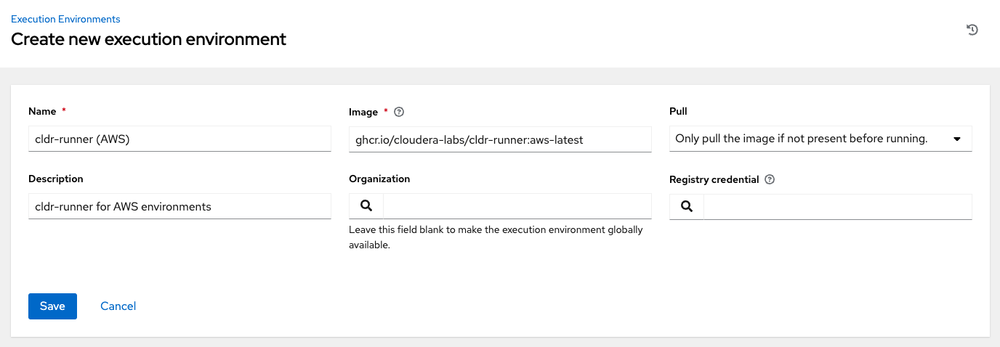

# cldr-runner - Ansible Execution Environments for Cloudera Data Platform (CDP)

[](https://github.com/cloudera-labs/cldr-runner/actions/workflows/publish.yml)

`cldr-runner` is a Ansible [Execution Environment](https://ansible.readthedocs.io/projects/builder/en/stable/#execution-environments) for running Cloudera playbooks, examples, and general automation for [**Cloudera Data Platform (CDP) Public Cloud, Private Cloud, and Data Services**](https://www.cloudera.com/products/cloudera-data-platform.html). The images are appropriate for use with [`ansible-navigator`](https://ansible.readthedocs.io/projects/navigator/) and [AWX](https://github.com/ansible/awx)/[Red Hat Ansible Automation Platform (AAP)](https://www.redhat.com/en/technologies/management/ansible).

Specifically, the project consists of `execution-environment.yml` configuration files and other supporting assets that power [`ansible-builder`](https://ansible.readthedocs.io/projects/builder/en/latest/). The configurations encapsulate the core Ansible collections and roles, Python libraries, and system applications to work with Cloudera's products.

`cldr-runner` contains:
- [`cloudera.cloud`](https://github.com/cloudera-labs/cloudera.cloud)
- [`cloudera.cluster`](https://github.com/cloudera-labs/cloudera.cluster)
- [`cdpcurl`](https://github.com/cloudera/cdpcurl)
- `git`

Each release is published for `amd64` and `arm64` architctures. Each image is tagged `cloudera-labs/cldr-runner:<version>-<arch>`, and there is a `latest` manifest.

# Quickstart

`cldr-runner` is designed to run with `ansible-navigator` and other _Execution Environment_-based tools. You might want to [install `ansible-navigator`](NAVIGATOR.md) before delving deeper.

1. [Installing and using images](#installing-and-using)
2. [Building local images](#building)
3. [Customizing or extending images](#customizing)
4. [Making a local development environment](#local-development)

# Roadmap

If you want to see what we are working on or have pending, check out:

* the [Milestones](https://github.com/cloudera-labs/cldr-runner/milestones) and [Active Issues](https://github.com/cloudera-labs/cldr-runner/issues?q=is%3Aissue+is%3Aopen+milestone%3A*) to see our current activity,
* the [Issue Backlog](https://github.com/cloudera-labs/cldr-runner/issues?q=is%3Aopen+is%3Aissue+no%3Amilestone) to see what work is pending or under consideration, and
* the [Ideas](https://github.com/cloudera-labs/cldr-runner/discussions/categories/ideas) discussion to see what we are considering..

Are we missing something? Let us know by [creating a new issue](https://github.com/cloudera-labs/cldr-runner/issues/new) or [posting a new idea](https://github.com/cloudera-labs/cldr-runner/discussions/new?category=ideas)!

# Contributing

For more information on how to get involved with the `cldr-runner` project, head over to [CONTRIBUTING.md](CONTRIBUTING.md).

# Installing and Using

You can run Ansible within `cldr-runner` Execution Environments a couple of different ways. Here are the most common:

## `ansible-navigator`

Using a `cldr-runner` image in the [`ansible-navigator` application](https://ansible.readthedocs.io/projects/navigator/) as the designated [Execution Environment](https://docs.ansible.com/ansible/devel/getting_started_ee/index.html) is straightforward. Update your `ansible-navigator.yml` configuration file to enable the image:

```yaml
ansible-navigator:
  execution-environment:
    enabled: True
    image: ghcr.io/cloudera-labs/cldr-runner:latest
    pull:
      policy: missing
```

Once defined, you can run your Ansible activities within the resulting `cldr-runner` container, e.g. `ansible-navigator run your_playbook.yml`. (You can specify the image via the `ansible-navigator` CLI; set `--eei` or `--execution-environment-image`.)

> [!NOTE]
> If you want to "drop into" the container directly, i.e. run a shell within the container, run `ansible-navigator exec -- /bin/bash` and all the mounts, environment variables, etc. are handled for you!! Now from the shell, you can still run `ansible-playbook` and all other Ansible applications.

## AWX/AAP

You can specify a `cldr-runner` image as an [Execution Environment](https://docs.ansible.com/automation-controller/latest/html/userguide/execution_environments.html).



Once defined, the EE can be used by Job Templates, Container Groups, etc.

## `docker run`

> [!WARNING]
> This mode of operation is not suggested. If you need direct container access, use `ansible-navigator exec -- /bin/bash` as suggested in the [section above](#ansible-navigator).

You can run the container directly in `docker` (or `podman`):

```bash
docker run -it ghcr.io/cloudera-labs/cldr-runner:latest /bin/bash
```

Take care to assemble and mount the needed directories other supporting assets; the image is based on [`ansible-runner`](https://ansible.readthedocs.io/projects/runner/en/stable/) (as are all Execution Environments) and runs as such.

# Building

If you need to construct a local image (with a build log), first set up a Python virtual environment with the latest `ansible-core` and `ansible-builder`:

```bash
hatch run build-local
```

Which is the equivalent to the following:

```bash
ansible-builder create;
docker build \
  --no-cache \
  --progress=plain \
  --build-arg BUILD_VER=$(hatch version) \
  --build-arg BUILD_DATE=$(date -u +%Y-%m-%dT%H:%M:%SZ) \
  --build-arg BUILD_REVISION=$(git rev-parse HEAD) \
  -t localhost/cldr-runner:$(hatch version) \
  context/ 2>&1 | tee build.log;
```

You may want to update the variation's `execution-environment.yml` configuration file to use a different base image, such as your newly minted local image. You can make this change in the following section of the configuration file:

```yaml
images:
  base_image:
    name: <your upstream or local image>
```

The resulting image will now be loaded into your local image cache.

# Customizing

A common approach to using `cldr-runner` is to use it as a base and add additional resources -- like other Ansible collections -- for use with your playbooks, and [`ansible-builder`](https://docs.ansible.com/projects/builder/en/latest/) handles this activity.

First, define your custom [Execution Environment definition](https://ansible.readthedocs.io/projects/builder/en/latest/definition/). In the example below, we are using the latest AWS image and adding two private Ansible collections, a public Ansible role, and a public Python library that we need to run our project's playbooks.

```yaml
version: 3

images:
  base_image:
    name: ghcr.io/cloudera-labs/cldr-runner:latest

options:
  package_manager_path: /usr/bin/microdnf

dependencies:
  python_interpreter:
    package_system: python3.12
    python_path: /usr/bin/python3.12
  galaxy:
    collections:
      - name: https://internal.example.com/my-team/example.stuff
        type: git
        version: devel
      - name: https://internal.example.com/another-team/example.things
        type: git
        version: feature/cool-things
    roles:
      - ansible.scm

additional_build_steps:
  append_final:
    RUN pip install jsonschema
```

Construct your custom image with `ansible-builder` (in the command below, we are using [`ansible-navigator` to call `ansible-builder`](https://ansible.readthedocs.io/projects/navigator/subcommands/#ansible-builder).)

```bash
ansible-navigator builder build -t internal.example.com/my-team/my-runner:latest -v 3
```

And now you can reference your (local) custom image in your project's `ansible-navigator.yml` file:

```yaml
ansible-navigator:
  execution-environment:
    container-engine: docker
    enabled: True
    image: internal.example.com/my-team/my-runner:latest
    pull:
      policy: missing
```

# Local Development

There are two `init`-style scripts that can assist in bootstrapping a non-containerized execution environment. See:

- [RHEL 9](./rhel9-init.sh)
- [Ubuntu 20 thru 24](./ubuntu-init.sh)

# License and Copyright

Copyright 2026, Cloudera, Inc.

```
Licensed under the Apache License, Version 2.0 (the "License");
you may not use this file except in compliance with the License.
You may obtain a copy of the License at

    https://www.apache.org/licenses/LICENSE-2.0

Unless required by applicable law or agreed to in writing, software
distributed under the License is distributed on an "AS IS" BASIS,
WITHOUT WARRANTIES OR CONDITIONS OF ANY KIND, either express or implied.
See the License for the specific language governing permissions and
limitations under the License.
```
